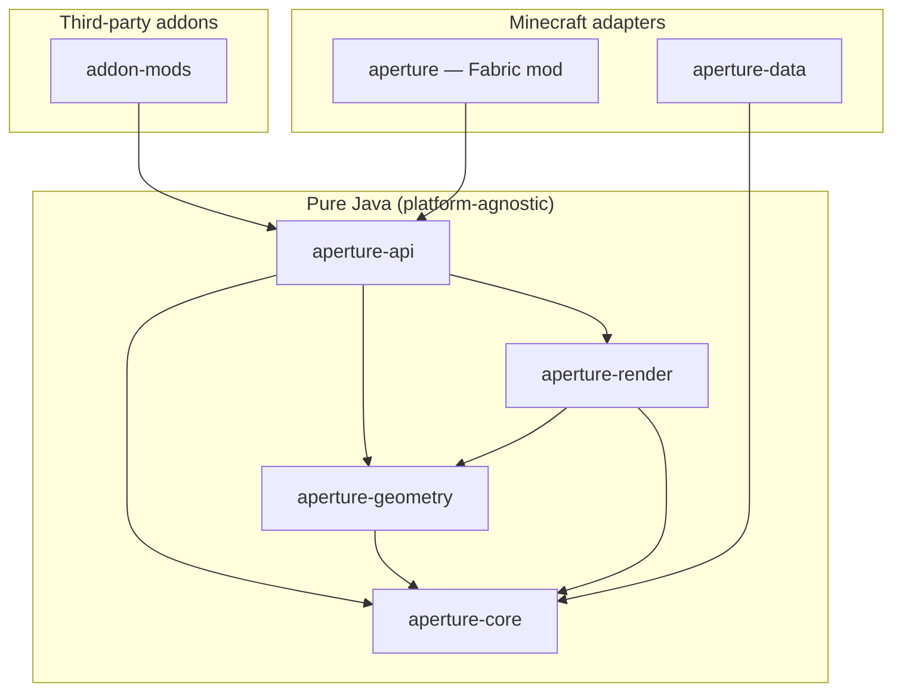

# 03 — Module Architecture

## Module Diagram



## Module Responsibilities

| Module | Responsibility | Minecraft Imports |
|---|---|---|
| `aperture-core` | Domain model, parameters, validation, codec contracts | **Forbidden** |
| `aperture-geometry` | Procedural mesh/solid generation | **Forbidden** |
| `aperture-render` | Render data, mesh, material, pipeline contracts | **Forbidden** |
| `aperture-api` | Stable public surface for addons | **Forbidden** |
| `aperture` (root) | World instances, placement, host cuts, networking, save, render | Allowed |
| `aperture-data` | Opening families, profiles, presets (JSON packs) | N/A |

## Dependency Rules

Enforced in CI — violations fail the build.

```
aperture-core        →  (no upward deps)
aperture-geometry    →  core
aperture-render      →  core, geometry
aperture-api         →  core, geometry, render
aperture (root mod)  →  api, render (client)
addon mods           →  api only (never common internals)
```

## Package Root

All Java code uses `dev.aperture` as the root package.

| Module | Package |
|---|---|
| core | `dev.aperture.core.*` |
| geometry | `dev.aperture.geometry.*` |
| render | `dev.aperture.render.*` |
| api | `dev.aperture.api.*` |
| fabric mod | `dev.aperture.*` (bootstrap, registry, network) |
| fabric client | `dev.aperture.client.*` |

## The Golden Rule

> If a class imports `net.minecraft.*`, it does not belong in `aperture-core`, `aperture-geometry`, or `aperture-api`.

Minecraft adapters live exclusively in the root Fabric module (`src/main`, `src/client`).

## Extension Points

| Extension Point | API Surface | Module |
|---|---|---|
| New opening type | JSON definition + optional `Generator` | api + data |
| New profile | JSON profile + extrude rule | data |
| New material resolver | `MaterialResolver` | api |
| New host type | `HostAdapter` | fabric mod (future) |
| New placement rule | `PlacementValidator` | api |
| New export format | `InterchangeExporter` | api (future) |
| New behavior | `OpeningBehavior` strategy | core |
