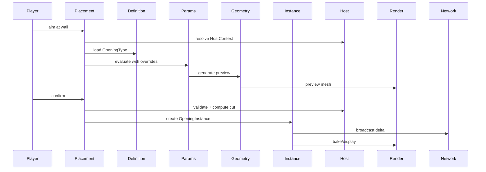

# 04 — Core Systems

Aperture is built from **nine cooperating systems**. Each has a narrow contract.

## 4.1 Definition System

**Purpose:** Describe *what* an opening type is.

- Loaded from `aperture-data` at startup.
- Validated against JSON Schema + semantic rules.
- **Immutable** after load; hot-reload only in dev mode.

```
OpeningTypeDefinition
├── id, version, category
├── parameterSchema
├── constraintRules
├── componentGraph
├── generatorBinding
├── materialSlots
└── defaultParameterValues
```

## 4.2 Parameter Engine

**Purpose:** Parametric behavior — dimensions, expressions, constraints.

- Typed parameters: `Length`, `Angle`, `Count`, `Enum`, `MaterialRef`, `Bool`
- Expressions: `sill_height = floor_to_ceiling * 0.15` (Phase 3)
- Constraints: min/max, coupled rules
- Units: internal millimeter-like logical units; display conversion in UI
- Evaluation via dependency graph (powers future node editor)

## 4.3 Geometry Kernel

**Purpose:** Procedural generation of opening solids and meshes.

```
ParameterSet + Definition  →  Generator  →  GeometryResult
                                              ├── Solids (frame, panels)
                                              ├── Glass planes
                                              ├── Cut volumes (host boolean)
                                              ├── Collision bounds
                                              └── LOD variants
```

- Pure Java, deterministic, seedable.
- Generators pluggable via `GeneratorRegistrar`.

## 4.4 Instance System

**Purpose:** A placed opening in the world.

- One **Opening Block Entity** per instance — not one block per mullion/panel.
- Sub-components are generated geometry, not independent block entities.

## 4.5 Host System

**Purpose:** Relationship between opening and building fabric.

```
HostContext
├── hostType (wall, roof, curtain_wall_host, free_standing)
├── hostPlane (origin, normal, width, height)
├── thickness
├── materialContext
└── structuralConstraints
```

- Computes cut volume for wall integration.
- Validates placement (fits host, min edge distance).
- Future BIM: hostRef maps to IfcWall, IfcCurtainWall.

## 4.6 Placement System

**Purpose:** Interactive and programmatic placement.

States: `Idle → Targeting → Preview → Validate → Commit → Instance`

- Raycast against host surfaces.
- Live preview with parameter gizmos.
- Server-authoritative commit.
- Snap: center, equal margins, grid, adjacent openings.

## 4.7 Catalog System

**Purpose:** Registries for types, profiles, materials, hardware.

```
Catalog
├── OpeningTypes
├── Profiles
├── GlazingSystems
├── HardwareSets
└── MaterialResolvers
```

Addon mods register via API — never by editing core JSON.

## 4.8 Rendering System

Client-only. See [05-rendering.md](05-rendering.md).

## 4.9 Serialization & Sync System

See [07-serialization.md](07-serialization.md).

## System Interaction


