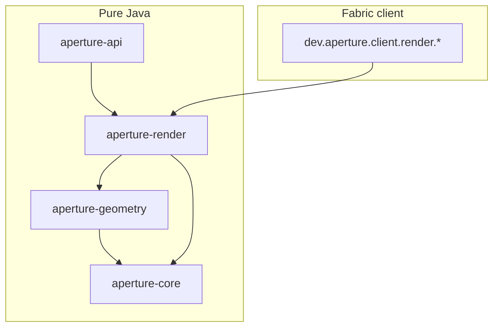
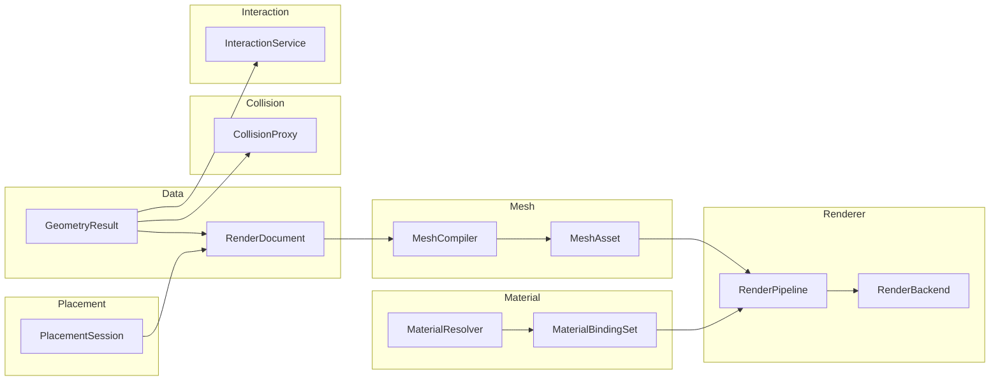
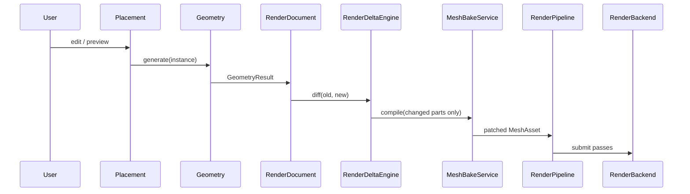

# 05 — Rendering Architecture

## Problem

A single opening may produce **hundreds of sub-elements** (mullions, gaskets, glass). Per-sub-element block models do not scale. Rendering must be **completely independent from Minecraft blocks**.

## Design Principles

| Principle | Implication |
|---|---|
| Blocks are not geometry | One logical instance, one render entity — never one block per mullion |
| Data ≠ Mesh ≠ Material ≠ Draw | Geometry, buffers, shading, and GPU submission are separate layers |
| Stable part identity | Every solid has a persistent `PartId` so diffs survive parameter edits |
| Material rebind without rebake | Swapping finish or glass tint updates bindings only |
| Preview is a render mode | Ghost, frame-only, glass-only are visibility policies, not duplicate pipelines |
| Collision ≠ render mesh | Physics uses simplified proxies from `GeometryResult`, never GPU buffers |
| Backend swappable | `RenderBackend` abstracts immediate-mode, instancing, compute mesh gen, RT |

## Module Layout



| Module | Package | Minecraft imports |
|---|---|---|
| `aperture-render` | `dev.aperture.render.*` | **Forbidden** |
| Fabric client | `dev.aperture.client.render.*` | Allowed |

## Seven Separated Concepts



## End-to-End Pipeline



## Layer 1 — Data

| Class | Responsibility |
|---|---|
| `PartId` | Stable identity derived from `GeometrySolid.componentPath()` |
| `RenderPart` | One logical piece: id, solid snapshot, part revision |
| `PartRegistry` | `PartId → RenderPart` with add/remove/update |
| `RenderRevision` | Monotonic local counter; distinct from instance network revision |
| `RenderDocument` | Authoritative render view; applies deltas, tracks dirty parts |
| `RenderDeltaEngine` | Compares geometry snapshots → `RenderDelta` |
| `RenderDelta` | `added`, `removed`, `changed`, `unchanged` part sets |
| `DirtyPartTracker` | Coalesces rapid edits (live resize debounce) |
| `PreviewRenderContext` | Ephemeral document from `PlacementSession` |

### Incremental update rule

Only `added` + `changed` parts go through `MeshCompiler`. `unchanged` parts retain GPU handles.

## Layer 2 — Mesh

| Class | Responsibility |
|---|---|
| `MeshAsset` | Container for one LOD tier; updated via copy-on-write patch |
| `MeshSection` | One draw unit: vertices, indices, layer, bounds |
| `MeshHandle` | Opaque link from `RenderPart` to backend buffer |
| `MeshCompiler` | `GeometrySolid → MeshSection` |
| `BoxMeshCompiler` | Phase 0: AABB → 12 triangles |
| `MeshBakeService` | Compiles dirty parts, patches asset |
| `LODLevel` | `FULL`, `MEDIUM`, `LOW`, `IMPOSTOR` |
| `LODGenerator` | Pre-simplify mesh variants (future) |

### Future hooks

| Class | Responsibility |
|---|---|
| `MeshGenerationStrategy` | `CpuCompiler`, `GpuComputeGenerator`, `ProceduralGenerator` |
| `GpuMeshGenerator` | Compute-shader mesh output (future) |
| `MeshRecipe` | Declarative parametric surface for CPU or GPU path |

## Layer 3 — Material

| Class | Responsibility |
|---|---|
| `MaterialDefinition` | Albedo, roughness, alpha mode, normal map ref |
| `MaterialInstance` | Resolved definition + overrides |
| `MaterialBinding` | Part or layer → material instance + blend mode |
| `MaterialBindingSet` | Immutable per-frame snapshot |
| `MaterialResolver` | API extension: slot + context → instance |
| `MaterialPreviewMode` | `FULL`, `FRAME_ONLY`, `GLASS_ONLY`, `ALBEDO`, etc. |
| `MaterialFilterPolicy` | Preview mode → visibility mask |

Material swap rebinds only — no mesh recompilation.

## Layer 4 — Renderer (client adapter)

| Class | Responsibility |
|---|---|
| `RenderPipeline` | Pass orchestration: cull, LOD, batch, submit |
| `RenderPass` | `OPAQUE`, `TRANSLUCENT`, `GHOST`, `DEBUG_OVERLAY` |
| `RenderMode` | Composable preview flags |
| `RenderBackend` | Upload mesh, draw batches, release — Fabric impl |
| `InstanceBatchBuilder` | Groups identical mesh+material for instancing |
| `LODSelector` | Distance → LOD level |
| `FabricRenderBackend` | MC 26.1 render API adapter |
| `OpeningInstanceRenderer` | One BE per instance |
| `PreviewOverlayRenderer` | Ghost preview (replaces wireframe over time) |

### Render passes

```
Frame → cull → LOD → OPAQUE_FRAME → CUTOUT_HARDWARE → GHOST? → TRANSLUCENT_GLASS → DEBUG_OVERLAY
```

## Preview Modes

| Mode | Flags | Mesh | Material |
|---|---|---|---|
| Ghost Preview | `GHOST`, `NO_COLLISION` | Full LOD0 | Alpha 0.35 |
| Live Editing | `INCREMENTAL`, `HIGHLIGHT_DIRTY` | Dirty parts only | Unchanged |
| Dynamic Resize | `INCREMENTAL`, `GHOST` | Throttled recompile | Unchanged |
| Material Preview | `REBIND_ONLY` | Unchanged | Re-resolve all |
| Frame Preview | `FILTER_LAYER` | Unchanged | Opaque + cutout only |
| Glass Preview | `FILTER_LAYER` | Unchanged | Translucent only |
| Committed | — | Full baked | Full |

## Layer 5 — Placement (boundary)

Placement stays in `aperture-core`. Rendering consumes `PlacementSession` via `PreviewRenderContext`. Placement never calls `RenderBackend`.

## Layer 6 — Collision

| Class | Responsibility |
|---|---|
| `CollisionProxy` | Simplified AABB tree / compound boxes for physics |
| `CollisionProxyBuilder` | Builds from geometry solids filtered by layer |
| `CutVolume` | Host boolean (`GeometryResult.cutVolume`) — host system, not renderer |

Preview modes with `NO_COLLISION` skip proxy registration.

## Layer 7 — Interaction

| Class | Responsibility |
|---|---|
| `InteractionService` | Raycast against collision proxies + gizmo handles |
| `PickTarget` | Part id, hit point, distance |
| `GizmoHandle` | Parametric handle → parameter edit → placement |

## Instancing

`InstanceBatchBuilder` groups records by `BatchKey(mesh, material, LOD, pass)`. Instancing enabled when count ≥ 4.

## LOD

| Level | Distance | Detail |
|---|---|---|
| FULL | 0–16m | All parts |
| MEDIUM | 16–48m | Merged sub-detail |
| LOW | 48–96m | Layer group boxes |
| IMPOSTOR | 96m+ | Billboard / bounds |

## Ray Tracing (future)

- `MeshSection` stores RT-ready triangle format
- `MaterialDefinition` includes IOR, roughness, normal for hit shaders
- `RayTraceBackend extends RenderBackend` for BLAS/TLAS + pick rays

## Package Map

```
aperture-render/src/main/java/dev/aperture/render/
├── data/          RenderDocument, RenderDeltaEngine, PartId, …
├── mesh/          MeshAsset, MeshCompiler, BoxMeshCompiler, …
├── material/      MaterialBindingSet, MaterialPreviewMode, …
├── pipeline/      RenderPipeline, RenderBackend, RenderMode, …
└── collision/     CollisionProxy, CollisionProxyBuilder
```

```
src/client/java/dev/aperture/client/render/
├── FabricRenderBackend.java
├── OpeningInstanceRenderer.java
├── PreviewOverlayRenderer.java
└── material/FabricMaterialResolver.java
```

## Relationship to Existing Code

| Existing | Role |
|---|---|
| `GeometryResult` / `GeometrySolid` | Input to delta engine and mesh compiler |
| `GeometryLayer` | Maps to render pass and material filter |
| `PlacementPreviewRenderer` | Phase 0 wireframe; superseded by ghost mesh + debug pass |
| `OpeningInstance.revision` | Network sync; local edits use `RenderRevision` |

## Implementation Phases

| Phase | Deliverable | Status |
|---|---|---|
| 1a | `aperture-render` module: data + mesh contracts, delta engine, box compiler | **In progress** |
| 1b | `FabricRenderBackend`, ghost preview mesh | Planned |
| 2a | Material resolver, preview filters | Planned |
| 2b | Async bake, live resize debounce | Planned |
| 3 | Instancing, LOD pre-bake, collision proxies | Planned |
| 4 | GPU mesh gen, RT backend extension | Future |

## Phase 0 Placement Preview (current)

Wireframe overlay via `PlacementPreviewRenderer` + Gizmos API. See [10-fabric-placement-adapter.md](10-fabric-placement-adapter.md).
