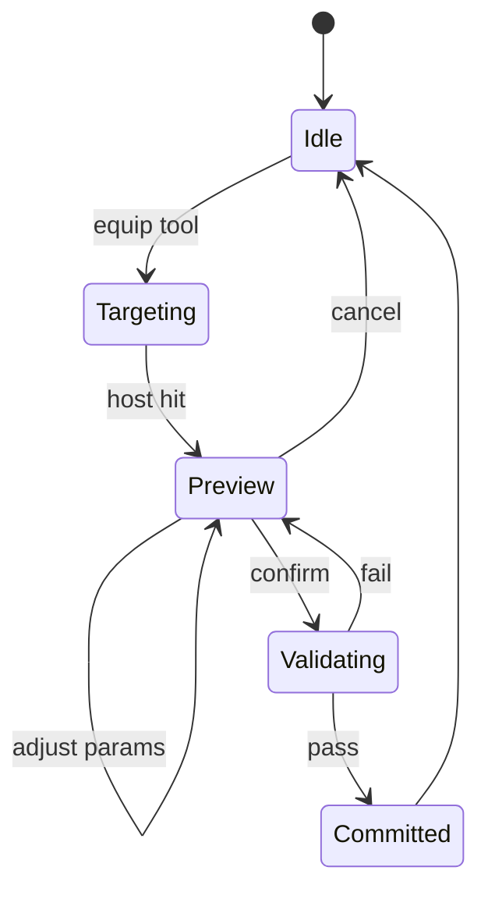

# 06 — Placement Architecture

## Placement Context

```
PlacementSession
├── activeTool
├── selectedTypeId
├── parameterOverrides (live)
├── previewInstance (transient)
├── targetHost (optional)
└── validationReport
```

## Placement Flow



## Host Detection

1. Raycast → block face (`FabricPlacementRaycast` / crosshair `HitResult`).
2. Classify host (`HostClassifier` — solid occluding blocks).
3. Build host region by scanning coplanar faces (`HostPlaneScanner`).
4. Convert to core `PlacementContext` via `FabricPlacementAdapter`.

Fabric adapter package: `dev.aperture.placement.fabric` (root mod module).
Client preview: `ClientPlacementPreview` updates each tick from crosshair; press **P** to commit a valid preview.
Wireframe overlay: `PlacementPreviewRenderer` — see [10-fabric-placement-adapter.md](10-fabric-placement-adapter.md).

## Validation Rules (extensible chain)

```
PlacementValidator
├── HostExistsValidator
├── FitsWithinHostValidator
├── MinEdgeDistanceValidator
├── NoOverlapValidator
├── ParameterConstraintValidator
└── PermissionValidator
```

## Commit Operations (server-side, atomic)

1. Create `OpeningInstance`.
2. Apply host cut (modify wall blocks or register cut mask).
3. Place opening anchor block/entity.
4. Broadcast `OpeningPlacedEvent` + network packet.
5. Record undo snapshot (future editor).

## Edit Placement

- In-place parameter edit regenerates geometry without re-placing.
- Reposition = new transform + revalidate host binding.
- Type change = new definition, preserve compatible parameters.
