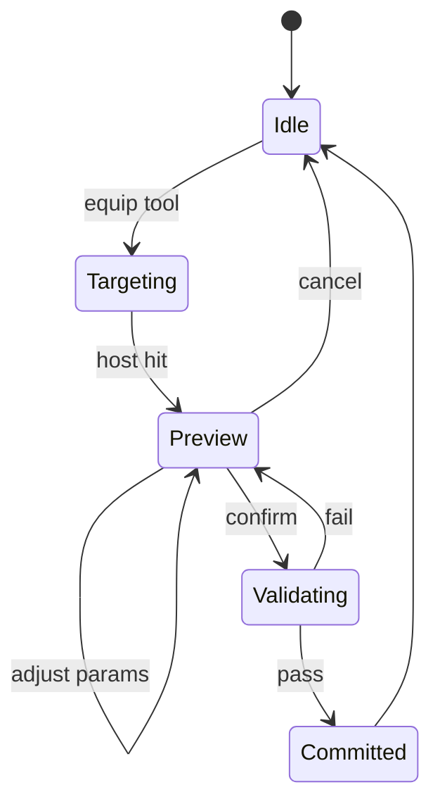

# 06 — Placement Architecture

## Placement Context

```
PlacementSession
├── activeTool
├── selectedTypeId
├── parameterOverrides (live)
├── previewInstance (transient)
├── targetHost (optional)
└── validationReport
```

## Placement Flow



## Host Detection

1. Raycast → block face.
2. Classify host (full block wall, aperture wall block, custom host tag).
3. Build `HostPlane`: derive width/height extents by scanning coplanar faces.
4. Compute max opening bounds within host.

## Validation Rules (extensible chain)

```
PlacementValidator
├── HostExistsValidator
├── FitsWithinHostValidator
├── MinEdgeDistanceValidator
├── NoOverlapValidator
├── ParameterConstraintValidator
└── PermissionValidator
```

## Commit Operations (server-side, atomic)

1. Create `OpeningInstance`.
2. Apply host cut (modify wall blocks or register cut mask).
3. Place opening anchor block/entity.
4. Broadcast `OpeningPlacedEvent` + network packet.
5. Record undo snapshot (future editor).

## Edit Placement

- In-place parameter edit regenerates geometry without re-placing.
- Reposition = new transform + revalidate host binding.
- Type change = new definition, preserve compatible parameters.
