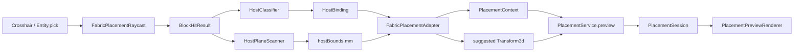

# 10 — Fabric Placement Adapter

This document describes the **Fabric-side placement adapter** that bridges Minecraft world interaction (raycasts, block faces, host geometry) to the pure-Java core placement system (`PlacementContext`, `PlacementService`).

## Goals

| Goal | Rationale |
|---|---|
| Keep MC code out of `aperture-core` | ADR 0002 — core remains testable without Minecraft |
| Convert raycast → `PlacementContext` | Core validators operate on logical mm space, not blocks |
| Support client preview | Crosshair targeting drives live validation before commit |
| Prepare for server authority | Same adapter can run on server with `Entity.pick()` |

## Module Placement

```
aperture-core          PlacementContext, PlacementService, validators (pure Java)
        ↑
aperture-api           exposes PlacementService via ApertureApi
        ↑
root Fabric mod
  src/main/.../placement/fabric/   ← adapter (Level, BlockPos, Direction)
  src/client/.../placement/        ← crosshair preview + wireframe renderer
  src/client/.../render/placement/ ← Gizmo-based debug overlay
```

**Golden rule:** `dev.aperture.placement.fabric.*` may import `net.minecraft.*`. `aperture-core` must not.

## Coordinate System

| Space | Unit | Origin semantics |
|---|---|---|
| Minecraft world | 1 block = 1.0 | Block min corner |
| Aperture logical | 1 block = **1000 mm** | Opening transform origin = bottom-left-inside corner |

Conversion utilities:

- `McUnits` — constants and block↔mm helpers
- `McCoordinates` — `BlockPos` / `Vec3` → `Vec3d` (mm)
- `McBoundsConverter` — core `BoundingBox` (mm) → `AABB` (blocks) for rendering

## Pipeline Overview



## Step 1 — Raycast (`FabricPlacementRaycast`)

**Input:** viewer `Entity`, optional client `HitResult` (crosshair).

**Output:** `BlockHitResult` with `BlockPos` + clicked `Direction` (face).

Strategy:

1. Prefer client crosshair `HitResult` when type is `BLOCK`.
2. Fallback: construct `ClipContext` from eye position + view vector (5-block reach).

## Step 2 — Host Classification (`HostClassifier`)

A block is a valid **host** when:

```java
!state.isAir() && state.canOcclude()
```

| Clicked face axis | `HostType` |
|---|---|
| Horizontal (N/S/E/W) | `WALL` |
| `UP` | `ROOF` |
| `DOWN` | `WALL` (floor openings — may split later) |

## Step 3 — Host Region Scan (`HostPlaneScanner`)

From the hit block and face, expand a coplanar solid region:

1. **Plane axes** — derived from face normal (tangent U/V + depth along face).
2. **Expand U/V** — flood outward while every cell in the slice remains host-solid (max 32 blocks).
3. **Expand depth** — into the wall while the slice remains solid (max 8 blocks).
4. **Output** — `HostRegion(minInclusive, maxInclusive, face)`.

This implements the architecture intent in `06-placement.md`: *"derive width/height extents by scanning coplanar faces"*.

## Step 4 — Adapter Assembly (`FabricPlacementAdapter`)

Produces `FabricPlacementTarget`:

| Field | Source |
|---|---|
| `hitPos`, `hitFace` | `BlockHitResult` |
| `host` | `HostBinding(type, anchor)` |
| `hostBounds` | scanned block region → mm `BoundingBox` |
| `placementContext` | host + bounds + existing instances on same anchor |
| `suggestedTransform` | inner-bottom-left on host inner face, facing = opposite of clicked face |

### Host anchor format

```
{x},{y},{z}..{X},{Y},{Z}:{face}
```

Example: `5,2,10..7,4,10:north` — wall region on the north face of blocks (5–7, 2–4, z=10).

Existing instances are matched by exact `host.anchor()` equality.

### Suggested transform

- **Origin:** inner face of scanned region, inset 1 mm to avoid z-fighting.
- **Facing:** opening looks into the room (opposite of exterior face normal).

## Step 5 — Core Preview (`PlacementService`)

`ClientPlacementPreview` (client tick):

1. Calls `FabricPlacementAdapter.fromCrosshair(...)`.
2. On hit → `PlacementService.preview(fixed_window, overrides, transform, host, context)`.
3. Stores `FabricPlacementTarget` + `PlacementSession`.

**Commit:** key **P** → `PlacementService.commit(session)` if `session.isValid()`.

## Step 6 — Wireframe Preview (`PlacementPreviewRenderer`)

Rendered each frame via `LevelRenderEvents.BEFORE_GIZMOS` using Minecraft 26.1 **Gizmos API**:

| Box | Color | Meaning |
|---|---|---|
| Host bounds | Cyan stroke | Maximum available opening area on this wall |
| Opening footprint | Green stroke | Valid placement (passes all validators) |
| Opening footprint | Red stroke | Invalid placement (shows rejection) |

Footprint derived from `OpeningFootprint.worldBounds(definition, previewInstance)` — uses `width`, `height`, `frame_width` parameters in mm.

Gizmo style: `GizmoStyle.stroke(color)` with `setAlwaysOnTop()` so lines remain visible through terrain.

## Validation Chain (recap)

`PlacementService.preview()` merges:

1. `ParameterConstraintValidator` — min/max/default parameter rules
2. `FitsWithinHostValidator` — footprint ⊆ hostBounds
3. `NoOverlapValidator` — no intersection with existing instances on same anchor

## Build Requirements

| Module | Java version | Reason |
|---|---|---|
| `aperture-core`, `aperture-geometry`, `aperture-api` | 21 | Pure Java, local dev friendly |
| Root Fabric mod | **25** (toolchain) | Minecraft 26.1 ships class file v69 |

Gradle Foojay resolver auto-provisions JDK 25 for the Fabric module only.

## Future Work

| Item | Phase |
|---|---|
| Server-side placement validation on commit | Phase 0/1 |
| Network `PlacementPreview` packet | Phase 1 |
| Host cut preview (stencil / subtractive overlay) | Phase 1 |
| Parameter gizmos (width/height drag handles) | Phase 2 |
| Custom aperture wall block hosts + tags | Phase 1 |
| Arbitrary rotation (full `Transform3d` basis vectors) | Phase 2+ |

## Key Files

| Purpose | Path |
|---|---|
| Adapter entry | `src/main/java/dev/aperture/placement/fabric/FabricPlacementAdapter.java` |
| Host scan | `src/main/java/dev/aperture/placement/fabric/HostPlaneScanner.java` |
| Client preview state | `src/client/java/dev/aperture/client/placement/ClientPlacementPreview.java` |
| Wireframe renderer | `src/client/java/dev/aperture/client/render/placement/PlacementPreviewRenderer.java` |
| Core placement | `aperture-core/.../placement/PlacementService.java` |
