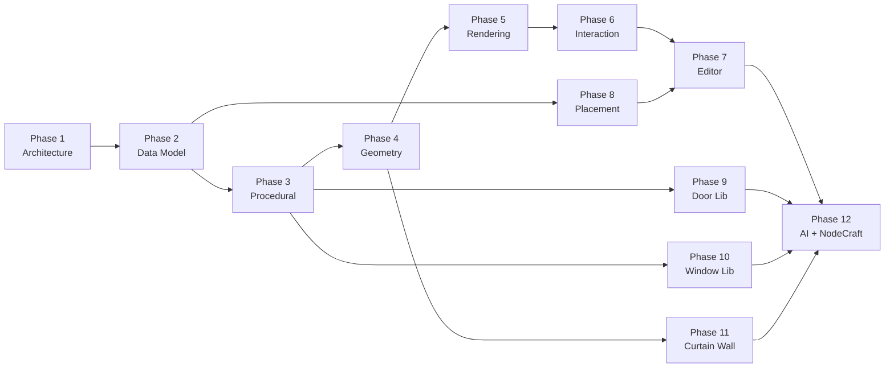

# 12 — Twelve-Phase Product Roadmap

Aperture 的完整**工程任务分解**，将项目拆分为 **12 个可交付阶段**。每个阶段有明确的目标、交付物、依赖关系与验收标准。

> **产品决策框架：** 见 [13-platform-roadmap-af.md](13-platform-roadmap-af.md)（Phase A–F + **族库冻结策略**）。本文档回答「具体 deliverable 如何拆分」；A–F 文档回答「现在该做什么、不该做什么」。
>
> **族库冻结：** Phase 9（Door Library）、Phase 10（Window Library）、Phase 11（Curtain Wall）在 [13-platform-roadmap-af.md](13-platform-roadmap-af.md) 定义的 Phase B + C 验收通过前**不得启动**。
>
> **Phase 0（Foundation）** 已基本完成：多模块 Gradle 结构、参考窗型、放置预览、幽灵网格渲染、材质目录等。本文档的 12 阶段在此基础上向完整平台演进。

## 总览

| Phase | 名称 | 核心产出 | 预估周期 |
|---|---|---|---|
| **1** | Architecture | 模块边界、系统契约、ADR | 1–2 月 |
| **2** | Core Data Model | Definition / Instance / 序列化 / 网络 | 2–3 月 |
| **3** | Procedural Engine | 参数引擎、分阶段生成管线 | 3–4 月 |
| **4** | Geometry Engine | Profile 挤出、CSG、碰撞体 | 3–4 月 |
| **5** | Rendering Engine | 增量网格、LOD、材质绑定 | 2–3 月 |
| **6** | Interaction System | 拾取、Gizmo、尺寸标注 | 2–3 月 |
| **7** | Editor | CAD 式游戏内编辑器 | 3–5 月 |
| **8** | Placement System | 宿主检测、切割、提交、同步 | 2–3 月 |
| **9** | Door Library | 门型族库（平开、推拉、双扇） | 2–3 月 |
| **10** | Window Library | 窗型族库（固定、开启扇、百叶） | 2–3 月 |
| **11** | Curtain Wall | 幕墙网格、竖横梃、多面板 | 3–4 月 |
| **12** | AI + NodeCraft | 节点图编辑器、AI 参数生成 | 6–12 月 |



### 核心流水线（贯穿所有阶段）

```
Definition → Validation → Generation → Placement → Instance → Render/Sync
```

---

## Phase 1 — Architecture（软件架构）

### 目标

建立可维护 5–10 年的模块化架构，确保核心逻辑与 Minecraft 完全解耦。

### 范围

- Gradle 多模块拆分与依赖规则
- 九大核心系统契约（Definition / Parameter / Geometry / Instance / Host / Placement / Catalog / Render / Serialization）
- 架构决策记录（ADR）
- JSON Schema 契约
- CI 模块依赖检查

### 交付物

| 交付物 | 路径 |
|---|---|
| 愿景与原则 | `docs/architecture/01-vision.md` |
| 模块架构 | `docs/architecture/03-module-architecture.md` |
| 核心系统 | `docs/architecture/04-core-systems.md` |
| 文件夹结构 | `docs/architecture/09-folder-structure.md` |
| ADR | `docs/architecture/ADRs/` |
| Schema | `docs/schemas/` |
| 模块 | `aperture-core`, `aperture-geometry`, `aperture-render`, `aperture-api`, `aperture-data` |

### 依赖

无（起点）。

### 验收标准

- [x] 核心模块零 `net.minecraft` 导入
- [x] 模块依赖图单向无环
- [x] 每个核心系统有文档与边界定义
- [x] 至少 2 条 ADR 记录关键决策
- [ ] CI 自动检查模块违规导入

### 当前状态：**基本完成**

---

## Phase 2 — Core Data Model（Opening 数据模型）

### 目标

定义 Aperture 的唯一领域实体——**Opening**，以及 Definition（族）与 Instance（实例）的完整生命周期。

### 范围

- `OpeningTypeDefinition` — 不可变、版本化、数据驱动
- `OpeningInstance` — 可变、世界持久化、网络同步
- `ParameterSet` / `ParameterDefinition` — 类型化参数
- `HostBinding` / `Transform3d` / `OpeningState`
- `OpeningInstanceCodec` — JSON 编解码
- 世界持久化（NBT / Block Entity）
- 网络同步包与 `revision` 冲突解决

### 交付物

```
OpeningTypeDefinition
├── parameters, constraints, generator, components, materialSlots
OpeningInstance
├── instanceId, typeId, parameters, transform, host, state, revision
```

| 模块 | 包 |
|---|---|
| `aperture-core` | `dev.aperture.core.definition.*`, `instance.*`, `parameter.*`, `serialization.*` |
| Fabric mod | Block Entity, NBT 读写, 网络包 |

### 依赖

Phase 1。

### 验收标准

- [x] Definition / Instance 记录类型与 Builder
- [x] JSON Schema 校验 opening type 与 instance
- [x] `OpeningInstanceCodec` 往返测试
- [x] 内存 Instance Store 接口
- [ ] NBT 持久化：放置 → 保存 → 重载一致
- [ ] 网络同步：客户端修改 → 服务端权威 → 广播
- [ ] Schema 迁移框架（`schemaVersion` 升级路径）

### 当前状态：**进行中**（模型与编解码已完成，持久化待做）

---

## Phase 3 — Procedural Engine（参数化生成引擎）

### 目标

实现 Grasshopper 式的参数驱动生成管线——**一切从参数生成，禁止固定模型**。

### 范围

- 参数引擎：合并默认值、表达式求值（Phase 3+）、约束校验
- 分阶段生成管线：
  ```
  Bounds → Frame → Panel → Glass → Accessory → Assembly → Cut
  ```
- `GeneratorStage<I,O>` 契约与 `PipelineOrchestrator`
- `OpeningGenerationService` 编排：校验 → 生成
- `GeneratorRegistry` 插件注册
- 阶段输出缓存与增量失效

### 交付物

| 阶段 | 输出 |
|---|---|
| BoundsResolver | `OpeningBounds`, 局部坐标系 |
| FrameGenerator | `FrameOutput`（框梃 solids + skeleton） |
| PanelGenerator | `PanelLayout`（扇区分割 + 开启运动学） |
| GlassGenerator | `GlassOutput`（玻璃薄片 solids） |
| AccessoryGenerator | `AccessoryOutput`（五金锚点 + solids） |
| AssemblyReducer | `GeometryAssembly` |

| 模块 | 包 |
|---|---|
| `aperture-core` | `parameter/` 表达式图（后期） |
| `aperture-geometry` | `pipeline/`, `stage/` |
| `aperture-api` | `OpeningGenerationService`, `GeneratorRegistry` |

### 依赖

Phase 2（Definition + ParameterSet）。

### 验收标准

- [x] `OpeningGenerator` 接口 + `GeneratorRegistry`
- [x] 参考实现 `RectangularWindowGenerator`（Phase 0 单体）
- [ ] 拆分为 Frame / Panel / Glass / Accessory 四阶段
- [ ] 每阶段独立单元测试 + golden snapshot
- [ ] 参数变更仅使下游阶段失效（增量求值）
- [ ] 无 OBJ/固定网格资源依赖

### 当前状态：**起步**（单体 Generator 已完成，分阶段管线待实现）

---

## Phase 4 — Geometry Engine（几何内核）

### 目标

将抽象参数和 Profile 配方编译为精确几何体——挤出、曲面、CSG，纯 Java、确定性、可测试。

### 范围

- `SolidShape` 演进：`BoundingBox` → `Extrusion` → `BRep` / CSG
- `ProfileDefinition` + `ProfileCurve`（2D 截面折线/弧）
- 沿路径挤出（Frame 框梃、门槛、把手）
- 面板运动学求解器（平开、推拉、上悬）
- `CutVolume` 宿主布尔切割体
- `CollisionProxy` 简化碰撞体
- Golden geometry 测试

### 交付物

```
GeometrySolid
├── componentPath, materialSlot, layer, shape, localTransform
GeometryAssembly
├── solids[], bounds, cutVolume, componentIndex, collisionProxy
```

| 模块 | 包 |
|---|---|
| `aperture-geometry` | `profile/`, `primitives/`, `csg/`（后期）, `kinematic/` |
| `aperture-core` | `geometry.BoundingBox`, `Vec3d` |

### 依赖

Phase 3（生成管线输出形状描述）。

### 验收标准

- [x] `GeometrySolid` + `GeometryResult` 记录类型
- [x] `BoundingBox` 原语 + Phase 0 盒体生成
- [ ] Profile 挤出：标准 50×80 框梃截面
- [ ] 多 Profile 目录（`aperture-data/aperture/profiles/`）
- [ ] 开启扇运动学：`openRatio` 驱动旋转/平移
- [ ] CSG 布尔（框梃转角合角）— 可延后至 Phase 11
- [ ] Golden test：给定参数 → 固定 bounds 快照

### 当前状态：**起步**（盒体阶段完成，Profile 挤出待做）

---

## Phase 5 — Rendering Engine（渲染引擎）

### 目标

将 `GeometryAssembly` 编译为 GPU 可绘制网格，支持增量更新、材质重绑定、LOD，且与 Minecraft 块渲染完全分离。

### 范围

- 七层分离：Data → Mesh → Material → Pipeline → Placement → Collision → Interaction
- `RenderDocument` + `RenderDeltaEngine` 增量 Part 更新
- `MeshCompiler` 策略：Box → Extrusion → Surface
- `MaterialBindingSet` + `MaterialResolver` + 目录 JSON
- `RenderPipeline` 多 Pass：Opaque → Cutout → Translucent → Ghost → Debug
- `FabricRenderBackend` Minecraft 适配
- LOD 四级 + 实例批处理
- 预览模式：Ghost / Frame-only / Glass-only

### 交付物

| 渲染模式 | 用途 |
|---|---|
| Ghost Preview | 放置/编辑预览（半透明） |
| Live Editing | 脏 Part 高亮 + 节流重编译 |
| Material Preview | 仅重绑定材质 |
| Committed | 完整烘焙显示 |

| 模块 | 包 |
|---|---|
| `aperture-render` | `data/`, `mesh/`, `material/`, `pipeline/`, `collision/` |
| `src/client` | `FabricRenderBackend`, `OpeningInstanceRenderer`, `GhostPreviewMeshRenderer` |

### 依赖

Phase 4（GeometryAssembly 输入）。

### 验收标准

- [x] `aperture-render` 模块 + delta engine + box compiler
- [x] Ghost mesh 放置预览
- [x] 材质目录 + `CatalogMaterialResolver`
- [x] M 键切换 Frame / Glass 预览过滤
- [x] 已提交实例渲染（`OpeningInstanceRenderer`）
- [ ] Profile 挤出网格编译
- [ ] 异步烘焙 + live resize 防抖（10–20 Hz）
- [ ] LOD 预烘焙 + 实例批处理（≥4 相同批次）
- [ ] 碰撞代理注册

### 当前状态：**进行中**（核心架构与幽灵预览已完成，LOD/异步待做）

---

## Phase 6 — Interaction System（交互系统）

### 目标

在 3D 视口中提供 CAD 级交互：拾取、Gizmo 手柄、尺寸标注、部件选择。

### 范围

- `InteractionService` — 射线拾取链：Gizmo → 部件 → 宿主
- `GizmoHandle` — 参数化手柄（边角、边缘、分隔条）
- `PickTarget` — 命中 Part / Handle / Host
- `DimensionOverlay` — 屏幕空间标注线（宽、高、框宽、扇间距）
- `ComponentRef` 选择与高亮
- 工具模式切换（Select / Move / Resize / Frame / Glass / Accessory / Divider / Material）
- 吸附指示器可视化

### 交付物

```
InteractionService
├── raycast(pointer): PickResult
├── activeTool: ToolMode
└── gizmoState: GizmoHandleSet

GizmoHandle
├── parameterBinding: "width" | "height" | "mullions" | ...
├── drag(delta): ParameterDelta
└── snapPolicy: SnapSettings
```

| 模块 | 包 |
|---|---|
| `aperture-render` | `interaction/` |
| `src/client` | `GizmoRenderer`, `DimensionOverlay`, `ViewportPickRouter` |

### 依赖

Phase 5（渲染 Part 身份稳定）；Phase 3（手柄绑定参数名）。

### 验收标准

- [ ] 射线拾取 Gizmo 手柄优先于世界
- [ ] 拖拽手柄实时更新参数 + 预览
- [ ] 尺寸标注随参数变化刷新
- [ ] 点击部件 → Inspector 聚焦对应 slot/参数
- [ ] Shift 等比缩放、Alt 禁用吸附
- [ ] 手柄在远距离自动淡出

### 当前状态：**未开始**（架构已在 `05-rendering.md` 中定义）

---

## Phase 7 — Editor（编辑器）

### 目标

Aperture 的核心产品界面——游戏内专业建筑编辑器，CAD 手感，兼顾普通玩家与建筑师。

### 范围

- `DesignSession` — 扩展现有 `PlacementSession`
- HUD 布局：顶栏 + 工具轨 + 视口 + Inspector + 状态栏
- Inspector 参数面板（Width / Height / Thickness / Frame / Glass / Handle / Divider）
- 材质选择器（Slot → Family → Catalog entry）
- Frame / Glass / Accessory 子编辑器
- 模板与预设（Catalog Browser）
- Copy / Paste / Duplicate
- Undo / Redo（`EditorIntent` + `EditorCommandGateway` 模式）
- History 时间线（accepted command/revision log；Undo 提交补偿命令）
- 连续 Inspector/Gizmo 交互：拖动期间仅本地 Preview，释放时提交一次 Command
- P1 复制演进：Tracking Range、稳定 StateDelta、Edit Begin/Preview Update/Commit/Cancel（见 editor/04-interaction-transport.md）
- Generate（提交）按钮与校验反馈
- 未来 AI 命令栏占位

### 交付物

| 工作流 | 描述 |
|---|---|
| 创建 | 工具 → 瞄准墙体 → 调参 → Generate |
| 编辑 | 右键已放置 Opening → 修改 → Apply |
| 模板 | 目录浏览 → 选预设 → 进入设计会话 |
| 复制 | Copy → Paste / Paste attributes / Duplicate |

| 模块 | 包 |
|---|---|
| `aperture-core` | `editor/EditorProjection`, `EditorIntent`, `EditorCommandGateway`, `CompensatingHistory`, `SnapEngine` |
| `src/client` | `editor/EditorHud`, `CatalogBrowserScreen`, `InspectorPanels/` |

### 依赖

Phase 6（手柄与拾取）；Phase 5（实时预览）；Phase 2（Instance 提交）。

### 验收标准

- [ ] 新玩家 30 秒内完成标准窗放置
- [ ] Inspector ↔ 手柄双向同步
- [ ] 无效约束时 Generate 禁用 + 字段级错误提示
- [ ] Undo/Redo 通过权威补偿/前向命令覆盖所有可逆操作
- [ ] 模板保存/加载 ParameterSet + 材质快照
- [ ] 编辑器模式不阻断正常游戏操作（Esc 退出）

### 当前状态：**未开始**（设计已完成，见编辑器 UX 规格）

---

## Phase 8 — Placement System（放置系统）

### 目标

将设计会话中的预览实例权威地提交到世界中，包括宿主检测、校验、切割、网络同步。

### 范围

- `PlacementSession` 状态机：Idle → Targeting → Preview → Validate → Commit
- `FabricPlacementAdapter` — 十字准星 → `PlacementContext`
- `HostClassifier` + `HostPlaneScanner` — 墙体/屋面检测
- 校验器链：HostExists / FitsWithin / MinEdgeDistance / NoOverlap / ParameterConstraint / Permission
- 宿主切割（`CutVolume` → 墙体块修改）
- Opening Block Entity 锚点放置
- 就地编辑（参数变更不重新放置）
- 吸附策略栈：Host edge / Equal margin / Grid / Adjacent opening
- 网络：`OpeningPlacedEvent` + 服务端权威提交

### 交付物

```
PlacementSession
├── activeTool, selectedTypeId, parameterOverrides
├── previewInstance, targetHost, validationReport
```

| 模块 | 包 |
|---|---|
| `aperture-core` | `placement/` |
| Fabric mod | `fabric.placement.*`, `OpeningWorldPlacement` |
| `src/client` | `ClientPlacementPreview`, `PlacementPreviewMeshService` |

### 依赖

Phase 2（Instance 创建）；Phase 3（预览生成）；Phase 5（幽灵预览渲染）。

### 验收标准

- [x] `PlacementSession` + 校验器链接口
- [x] Fabric 十字准星 → PlacementContext
- [x] 幽灵网格预览
- [x] P 键提交预览
- [ ] 完整校验器链（含 NoOverlap 生产级）
- [ ] 宿主切割实现
- [ ] 就地参数编辑（不移动锚点）
- [ ] 吸附：宿主边缘 + 相邻 Opening 对齐
- [ ] 服务端权威 + 网络广播
- [ ] 撤销最后一次提交

### 当前状态：**进行中**（核心预览流程已完成，切割与网络待做）

---

## Phase 9 — Door Library（门库） 🔒

> **🔒 族库冻结中** — 见 [13-platform-roadmap-af.md — 族库冻结策略](13-platform-roadmap-af.md#族库冻结策略family-library-freeze)。Phase B + C 验收通过前不得启动。

### 目标

交付完整的门型族库——覆盖建筑项目中最常见的门类型，全部由参数化生成器驱动。

### 范围

- 门型 `OpeningTypeDefinition` 数据包
- `DoorGenerator` 管线（Frame + Panel + Glass + Accessory 门专用变体）
- 开启状态机：`OpeningState.openRatio`、铰链侧、摆动方向
- 门型目录：

| 类型 | 参数要点 |
|---|---|
| Single Swing | 单扇平开，左/右铰链 |
| Double Swing | 双扇对开 |
| Sliding | 推拉轨道，扇数 1–3 |
| Pocket | 入墙推拉（切割加深） |
| French Door | 双扇 + 中部竖梃 + 玻璃 |
| Garage Door | 多节提升（分段 Panel 运动学） |

- 五金目录：把手、铰链、闭门器、门槛
- 碰撞：开启时扫掠体积

### 交付物

```
aperture-data/aperture/opening_types/
├── single_swing_door.json
├── double_swing_door.json
├── sliding_door.json
├── french_door.json
└── ...
aperture-data/aperture/presets/
├── door_oak_single.json
└── ...
```

### 依赖

Phase 3（Panel + Accessory 阶段）；Phase 4（运动学）；Phase 8（放置 + 碰撞）。

### 验收标准

- [ ] ≥ 5 种门型定义 + 生成器
- [ ] 开启/关闭动画（`openRatio` 0→1）
- [ ] 开启时碰撞体正确更新
- [ ] 每型 ≥ 3 个材质预设（木/铁/玻璃）
- [ ] Golden geometry test per type
- [ ] 编辑器中可选可预览可放置

### 当前状态：**未开始**

---

## Phase 10 — Window Library（窗库） 🔒

> **🔒 族库冻结中** — 见 [13-platform-roadmap-af.md — 族库冻结策略](13-platform-roadmap-af.md#族库冻结策略family-library-freeze)。Phase B + C 验收通过前不得启动。

### 目标

交付完整窗型族库——从固定窗到开启扇、百叶、天窗，覆盖住宅与商业立面需求。

### 范围

- 扩展现有 `fixed_window` 为完整窗型系列
- `WindowGenerator` 管线变体
- 窗型目录：

| 类型 | 参数要点 |
|---|---|
| Fixed | 固定窗（Phase 0 参考） |
| Casement | 侧开扇 |
| Awning | 上悬 |
| Sliding | 推拉窗 |
| Double-Hung | 双扇升降（上下 Panel） |
| Mullioned | 竖梃/横梃网格 |
| Bay / Bow | 多面拼接（多 Instance 或复合 Generator） |
| Skylight | 屋面宿主，坡度依赖 |

- 玻璃系统：单层 / 双层 / 夹层
- 百叶 / 纱窗（Accessory 阶段）
- 窗台、窗套线（Profile 挤出）

### 交付物

```
aperture-data/aperture/opening_types/
├── fixed_window.json          (已有)
├── casement_window.json
├── sliding_window.json
├── double_hung_window.json
├── skylight.json
└── ...
```

### 依赖

Phase 3–4（Frame + Glass + Panel）；Phase 9 共享 Accessory/Hardware 目录。

### 验收标准

- [ ] ≥ 6 种窗型定义
- [ ] 竖梃/横梃参数化网格正确分割玻璃
- [ ] 开启扇运动学（casement/awning/sliding）
- [ ] 天窗支持屋面宿主检测
- [ ] 每型 golden test + 编辑器预设
- [ ] 与门库共享材质目录

### 当前状态：**起步**（`fixed_window` 参考型已完成）

---

## Phase 11 — Curtain Wall（幕墙） 🔒

> **🔒 族库冻结中** — 见 [13-platform-roadmap-af.md — 族库冻结策略](13-platform-roadmap-af.md#族库冻结策略family-library-freeze)。Phase B + C 验收通过前不得启动（`curtain_wall` reference 保留用于 pipeline 验证）。

### 目标

支持大型立面系统——网格化幕墙、竖框/横框/多面板，可跨越多个方块宿主。

### 范围

- `CurtainWallGridGenerator` — 网格参数：行、列、分格比、竖框/横框截面
- 多面板 `PanelLayout` 扩展（M×N 网格）
- 结构节点：竖框贯通、横框断点、隐框/明框
- 多宿主绑定（一段幕墙跨越多个墙段）
- 大尺寸 LOD 策略（远景合并为单一盒体）
- 结构校验：最大跨度、挠度约束表达式
- 开启扇嵌入（幕墙内开扇/下悬通风窗）

### 交付物

```
aperture-data/aperture/opening_types/
├── curtain_wall_basic.json
├── curtain_wall_structural.json
└── curtain_wall_unitized.json
```

| 特有参数 | 描述 |
|---|---|
| `grid_rows`, `grid_cols` | 分格数 |
| `mullion_profile` | 竖框截面 |
| `transom_profile` | 横框截面 |
| `panel_type` | 固定/开启/通风 |
| `max_span` | 结构跨度约束 |

### 依赖

Phase 4（Profile + 网格几何）；Phase 10（窗型 Panel 变体）；Phase 8（多宿主放置）。

### 验收标准

- [ ] 至少 3×3 网格幕墙正确生成
- [ ] 竖框/横框 Profile 挤出可见
- [ ] 各面板独立材质绑定
- [ ] 远景 LOD 降级为框架轮廓
- [ ] 编辑器支持网格参数 + 预览
- [ ] 结构约束违规时校验失败

### 当前状态：**未开始**

---

## Phase 12 — AI + NodeCraft Integration（AI 与 NodeCraft 集成）

### 目标

将 Aperture 提升到参数化设计平台巅峰——可视化节点图编辑（NodeCraft）与自然语言 AI 辅助生成。

### 范围

#### NodeCraft（可视化节点编辑器）

- `ParametricGraph` — 图定义 schema（nodes, edges, exposedParameters）
- `ParametricGraphEvaluator` — 拓扑排序 + 增量求值
- 节点类型注册表（复用 Phase 3 各 GeneratorStage）
- 客户端 NodeCraft UI：画布、连线、参数面板
- JSON ↔ 图双向转换（`OpeningTypeDefinition.generator` 可指向图）
- 默认管线序列化为可编辑图（`rectangular_window_v1` 图化）
- 高级节点：Boolean CSG、Transform、Expression、Custom Profile

#### AI 辅助

- 自然语言 → `ParameterSet` 建议（"居中三联窗，2400 宽，橡木框"）
- AI 差异高亮（变更参数脉冲预览）
- 合规规则验证（可扩展规则包）
- 设计意图 → 类型推荐（门/窗/幕墙选择）
- 多人协作：实例锁、区域权限、修订日志回放

### 交付物

```
aperture-core/graph/
├── ParametricGraph, GraphNode, Edge
├── ParametricGraphEvaluator
└── GraphNodeRegistry

src/client/nodecraft/
├── NodeCanvas, PortWidget, EdgeRenderer
└── GraphEditorScreen

aperture-data/aperture/graphs/
└── rectangular_window_v1.graph.json
```

### 依赖

Phase 3（所有 Stage 可节点化）；Phase 7（编辑器 AI 命令栏）；Phase 9–11（族库作为节点子图示例）。

### 验收标准

- [ ] 可视化编辑标准窗型图并实时预览
- [ ] 图存储为 JSON 并可由 `GeneratorRegistry` 加载
- [ ] 单参数变更仅重算下游节点
- [ ] AI 命令生成参数建议，用户确认后写入 `DesignSession`
- [ ] AI 建议通过同一校验链，不可绕过约束
- [ ] 图编辑器中可创建自定义幕墙分格逻辑

### 当前状态：**未开始**（架构预留于 `08-expansion-plan.md` Phase 3/5）

---

## 横切关注点（贯穿所有阶段）

### 测试策略

| 层 | 测试类型 | 适用阶段 |
|---|---|---|
| `aperture-core` | 单元：参数、约束、迁移 | 2, 3 |
| `aperture-geometry` | Golden snapshot：几何 bounds | 3, 4, 9–11 |
| `aperture-render` | Delta diff、mesh 计数 | 5 |
| Fabric mod | 集成：放置 → 保存 → 重载 | 8 |
| Client | 视觉回归（可选） | 5, 7 |

### 公共 API（addon 扩展）

| 扩展点 | 注册入口 | 最早可用阶段 |
|---|---|---|
| 新 Opening 类型 | JSON + Generator | 3 |
| 新 Generator Stage | `StageRegistry` | 3 |
| 新 Profile | `ProfileCatalog` | 4 |
| 新 Material Resolver | `MaterialResolverRegistry` | 5 |
| 新 Opening 行为 | `OpeningBehavior` | 9–10 |
| 自定义 Graph 节点 | `GraphNodeRegistry` | 12 |

### 版本与迁移

- 每个 JSON 实体携带 `schemaVersion`
- 迁移器在 Phase 2 建立，每阶段增量添加
- 生成器 ID 带版本后缀（`rectangular_window_v1`）

---

## 进度总览

| Phase | 名称 | 状态 |
|---|---|---|
| 1 | Architecture | ✅ 基本完成 |
| 2 | Core Data Model | 🔄 进行中 |
| 3 | Procedural Engine | 🔄 起步 |
| 4 | Geometry Engine | 🔄 起步 |
| 5 | Rendering Engine | 🔄 进行中 |
| 6 | Interaction System | ⬜ 未开始 |
| 7 | Editor | ⬜ 未开始（设计完成） |
| 8 | Placement System | 🔄 进行中 |
| 9 | Door Library | 🔒 冻结 |
| 10 | Window Library | 🔒 冻结 |
| 11 | Curtain Wall | 🔒 冻结 |
| 12 | AI + NodeCraft | ⬜ 未开始 |

---

## 相关文档

| 文档 | 关联阶段 |
|---|---|
| [01-vision.md](01-vision.md) | 1 |
| [02-domain-model.md](02-domain-model.md) | 2 |
| [03-module-architecture.md](03-module-architecture.md) | 1 |
| [04-core-systems.md](04-core-systems.md) | 1–3 |
| [05-rendering.md](05-rendering.md) | 5, 6 |
| [06-placement.md](06-placement.md) | 8 |
| [07-serialization.md](07-serialization.md) | 2 |
| [08-expansion-plan.md](08-expansion-plan.md) | 时间线补充（Phase 0–5 视角） |
| [10-fabric-placement-adapter.md](10-fabric-placement-adapter.md) | 8 |

---

## 时间线参考

以单人/小团队开发为基准的累计估算：

```
Month  1–2   ████ Phase 1
Month  2–5   ██████ Phase 2
Month  5–9   ████████ Phase 3 + 4（可并行）
Month  8–11  ██████ Phase 5 + 6（可并行）
Month 11–16  ██████████ Phase 7 + 8
Month 14–20  ████████ Phase 9 + 10（可并行）
Month 18–22  ██████ Phase 11
Month 22–34  ████████████ Phase 12
```

> 实际排期取决于团队规模。Phase 9/10/11 可在 Phase 7 完成后并行推进。Phase 12 是长期平台目标，可与族库阶段重叠开发图引擎核心。
