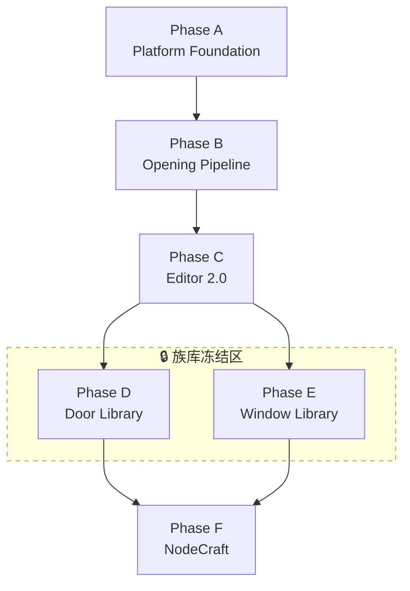

# 13 — Platform Roadmap (Phase A–F)

Aperture 的**产品决策框架**：六阶段平台演进路线，明确「平台先于内容」的优先级。

> **与工程路线图的关系**
>
> - 本文档（A–F）回答：**现在该做什么、不该做什么**（决策层）
> - [12-phase-roadmap.md](12-phase-roadmap.md) 回答：**具体 deliverable 如何拆分**（任务层）
> - [08-expansion-plan.md](08-expansion-plan.md) 保留早期时间线视角（Phase 0–5）

## 战略判断

Aperture 已经不像一个 Minecraft 装饰模组，更像**建筑设计引擎的雏形**。

接下来最大的风险不是「功能太少」，而是**过早增加门窗类型**，导致平台层被业务层绑架。若先把 `Parameter → Component → Geometry → Mesh → Render` 这条主干打磨成熟，后续新增一种门窗的成本会非常低，整个项目也会保持长期可维护性。

**核心原则：建立 Aperture Platform，而不是 Door Library。**

---

## 族库冻结策略（Family Library Freeze）

### 冻结范围

在 **Phase B（Opening Pipeline）与 Phase C（Editor 2.0）验收通过之前**，以下工作**全部暂停**：

| 禁止项 | 示例 |
|---|---|
| 新 Door 类型 | Single Door、Double Door、Sliding Door、Barn Door、French Door |
| 新 Window 类型 | Casement、Sliding、Awning、Hopper、Bay、Skylight（作为独立族） |
| 新 Curtain Wall 变体 | Unitized、Structural、隐框/明框系列 |
| 新 Generator 变体 | 为每种门型单独写 `XxxDoorGenerator` |
| 新 data pack opening type | `aperture-data/aperture/opening_types/` 下除 reference 外的 JSON |

### 允许的 Reference 类型（仅用于平台验证）

现有 reference 类型**保留、不扩展**，只用于 pipeline / editor / placement 的集成测试：

| 类型 | 用途 | 状态 |
|---|---|---|
| `fixed_window` | 矩形窗 reference，验证 Frame + Glass pipeline | 保留 |
| `door` | 参数化门族（组件组合，非独立 Generator） | 保留 |
| `curtain_wall` | 网格立面 reference，验证多 panel 布局 | 保留 |

> **注意**：`BuiltinOpeningTypes` 中的 `casementWindow()` 等 preset 代码可以保留为内部测试，但**不得**发布为新的 data pack 族，直到 Phase D/E 解冻。

### 解冻条件（Phase D / E 启动门槛）

族库（Door Library / Window Library）解冻需同时满足：

1. **Opening Pipeline 封板** — `Definition → Resolve → ComponentPlan → Geometry → Mesh → Collision → Render` 全链路有 golden test
2. **Parameter System 统一** — Editor、Generator、Placement 共用 `ResolvedOpening`，无 bypass 路径
3. **Component System 稳定** — 新增 opening 只需换 `ComponentAssembly`，不改 pipeline 代码
4. **Editor Foundation 可用** — Selection、Gizmo resize、Undo/Redo、Snap、Inspector 双向绑定已打通
5. **至少一条端到端演示** — 玩家可拖动手柄实时改 width，预览与提交一致

### 违规处理

- PR 若新增 opening type JSON 或独立 Generator，**应被 reject**，除非明确标注为「pipeline 测试 fixture」且不在 data pack 发布
- Code review 检查清单：「这个改动是在加固平台，还是在加业务类型？」

---

## 总览

| Phase | 名称 | 核心产出 | 对应 12-phase |
|---|---|---|---|
| **A** | Platform Foundation | Geometry Kernel、Parameter System、Component System | 1–4 |
| **B** | Opening Pipeline | Definition → Mesh → Collision → Placement 封板 | 3–5, 8 |
| **C** | Editor 2.0 | CAD 式交互：Selection、Gizmo、History、Snap、Constraint | 6–7 |
| **D** | Door Library | Modern / Industrial / Steel / Glass Door… | 9 |
| **E** | Window Library | Casement、Sliding、Bay、Skylight、Curtain Wall… | 10–11 |
| **F** | NodeCraft Integration | Opening = Node Graph | 12 |



### 核心流水线（贯穿 Phase A–C）

```
Opening Definition
  → Parameter Resolve
  → Component Graph
  → Geometry
  → Mesh
  → Collision
  → Placement
  → Render
```

---

## Phase A — Platform Foundation（当前）

### 目标

把**平台做完整**，不是做门。

### 重点

| 系统 | 模块 | 当前状态 |
|---|---|---|
| Geometry Kernel | `aperture-geometry` | 进行中 — Profile、Extrude、Boolean、Mesh 已有骨架 |
| Parameter System | `aperture-core/parametric` | 进行中 — 类型化参数 + 约束表达式 |
| Component System | `aperture-core/component` | 进行中 — Frame/Glass/Panel/Hardware 已定义 |

### 目标模块结构

```
aperture-geometry          # 纯 Geometry SDK，零 Minecraft 依赖
  Profile, Curve, Extrude, Boolean, Mesh, UV, Transform, BoundingBox

aperture-components         # 组件层（当前在 aperture-core/component，逻辑独立）
  FrameComponent, GlassComponent, PanelComponent,
  HandleComponent, TrimComponent, AccessoryComponent

aperture-opening-geometry   # Opening 装配 → Geometry Recipe
aperture-core               # Definition, Instance, Parameter, Placement, Validation
aperture-render             # Mesh → RenderPart
```

> `aperture-geometry` 已存在且零 `net.minecraft` 导入。`aperture-components` 可在 Component 接口稳定后再物理拆分为 Gradle 模块。

### 验收标准

- [x] `aperture-geometry` 模块，纯 Java，无 Opening 概念
- [x] Component 类型：Frame、Glass、Panel、Handle、Mullion、Trim、Sill
- [x] 参数类型：Range、Choice、Boolean、Material、Enum
- [ ] Geometry Kernel API 稳定（Profile → Extrude → Boolean → Mesh 可独立测试）
- [ ] Component 接口稳定（`OpeningComponent` + `ComponentAssembly` 契约文档化）
- [ ] 模块依赖图无环，CI 检查违规导入

### 当前状态：**进行中**

---

## Phase B — Opening Pipeline

### 目标

建立真正的 **Opening Pipeline**，封板整条生成链路。这是项目以后最重要的一层。

### 流水线

```
Opening Definition
  ↓
Parameter Resolve          OpeningParameterResolver
  ↓
Component Graph            ComponentPlanBuilder
  ↓
Geometry                   GeometryBuilder → GeometryRecipe IR
  ↓
Mesh                       MeshBuilder → MeshAssembly
  ↓
Collision                  CollisionProxy（待补）
  ↓
Placement                  OpeningFootprint（待补）
```

已有入口：`OpeningGenerationPipeline`（`aperture-opening-geometry`）。

### 交付物

| 输出 | 描述 |
|---|---|
| `ResolvedOpening` | 合并默认值 + 约束校验后的参数快照 |
| `ComponentPlan` | 按组件实例排列的生成步骤 |
| `GeometryRecipe` | 声明式几何 IR（可序列化、可导出 glTF） |
| `MeshAssembly` | Part 级三角网格 |
| `CollisionProxy` | 简化碰撞体 |
| `PipelineResult` | 上述输出的统一容器 |

### 验收标准

- [x] `OpeningGenerationPipeline` 主干串联
- [ ] Collision 作为 pipeline 正式输出
- [ ] Placement footprint 作为 pipeline 正式输出
- [ ] `fixed_window` + `door` 各一条 golden test（参数 → bounds snapshot）
- [ ] 参数变更仅 invalidate 下游 stage（增量求值）
- [ ] 新增 opening 类型**零 pipeline 代码改动**（仅换 ComponentAssembly）

### 当前状态：**骨架已有，未封板**

---

## Phase C — Editor 2.0

### 目标

真正做成 **CAD** — 编辑器基础设施先于内容库。

### 范围

| 能力 | 模块 | 当前状态 |
|---|---|---|
| Selection | `aperture-editor` | 骨架已有 |
| Move / Rotate / Resize | Gizmo + Manipulator | 部分实现 |
| Snap | `SnapEngine` | 骨架已有 |
| History | `EditHistory` + Commands | 骨架已有 |
| Dimension | 尺寸标注 overlay | 未开始 |
| Constraint | 字段级违规反馈 | 部分（core 约束引擎） |
| Inspector ↔ Gizmo 双向绑定 | Editor + Client | 未开始 |

### 用户体验目标

玩家直接拖 `□────────□`，宽度实时变化；Inspector 与 3D 手柄双向同步。

### 验收标准

- [ ] 射线拾取 Gizmo 手柄
- [ ] 拖拽手柄 → 参数更新 → pipeline 增量重编译 → 预览刷新
- [ ] Undo/Redo 覆盖会话内所有操作
- [ ] 无效约束时 Generate 禁用 + 字段级错误
- [ ] Esc 退出编辑器，不阻断正常游戏

### 当前状态：**起步（~20%）**

---

## Phase D — Door Library 🔒

> **族库冻结中** — 见上文「解冻条件」。

### 目标

Geometry 稳定后，才开始门型族库。

### 范围（解冻后）

- Modern Door、Industrial Door、Steel Door、Glass Door…
- 全部为 `ComponentAssembly` preset，共享同一 Generator
- 开启状态机：`openRatio`、铰链侧、扫掠碰撞

### 依赖

Phase B + Phase C 验收通过。

### 当前状态：**冻结 — 仅保留 `door` reference**

---

## Phase E — Window Library 🔒

> **族库冻结中** — 见上文「解冻条件」。

### 目标

窗型族库，全部共享同一 Geometry Kernel。

### 范围（解冻后）

Casement、Sliding、Awning、Hopper、Bay、Skylight、Curtain Wall 变体…

### 依赖

Phase B + Phase C 验收通过；与 Phase D 可并行。

### 当前状态：**冻结 — 仅保留 `fixed_window` + `curtain_wall` reference**

---

## Phase F — NodeCraft Integration

### 目标

Aperture 最精彩的一步 — **Opening = Node Graph**。

### 愿景

```
Rectangle
  ↓
Inset
  ↓
Frame
  ↓
Glass
  ↓
Divider
  ↓
Door
```

以后 Door 就是一个 Node Graph，不是 Java class。

### 范围

- `ParametricGraph` schema（nodes, edges, exposedParameters）
- `ParametricGraphEvaluator` — 拓扑排序 + 增量求值
- NodeCraft UI：画布、连线、参数面板
- 现有 pipeline 序列化为可编辑图
- AI 辅助：自然语言 → ParameterSet 建议

### 依赖

Phase B（所有 Stage 可节点化）；Phase C（编辑器 AI 命令栏占位）；Phase D/E（族库作为节点子图示例）。

### 当前状态：**未开始**

---

## 近期优先事项（未来 2–4 周）

族库冻结期间，**集中完成以下四件事**，不开发任何新门窗：

### 1. 统一 Parameter System

所有 Opening、Generator、Editor 围绕参数对象工作，禁止直接操作具体实现。

- 收口路径：`ParametricEditor` → `OpeningParameterResolver` → `ResolvedOpening`
- Editor `SetParameterCommand` 与 Placement preview 共用 resolver
- **验收**：改 `width` 时 Editor / Preview / Generate 三处 bounds 一致

### 2. 完成 Geometry Pipeline

固定 `Definition → Component → Geometry → Mesh → Render` 流水线。

- 补 Collision、Placement footprint 为正式输出
- Golden test：`fixed_window` + `door`
- **验收**：新增 opening 只换 ComponentAssembly，不改 pipeline

### 3. 抽象 Component System

Frame、Glass、Panel、Hardware 提升为一等公民。

- `ComponentPlanBuilder` 只认 `OpeningComponent`，不认 category
- 文档化 Component 契约；稳定后考虑拆为 `aperture-components` 模块
- **验收**：Door / Window / Curtain Wall 仅是 preset，不是类型

### 4. 完善 Editor Foundation

Selection、Gizmo、Undo/Redo、Snap、Inspector 先于内容库。

- Inspector ↔ Gizmo 双向绑定
- 参数变更 → pipeline 增量 invalidate → 预览刷新
- **验收**：拖手柄实时改 width，Undo 可恢复

---

## 进度总览

| Phase | 名称 | 状态 | 族库 |
|---|---|---|---|
| A | Platform Foundation | 🔄 进行中 | — |
| B | Opening Pipeline | 🔄 骨架已有 | — |
| C | Editor 2.0 | 🔄 起步 | — |
| D | Door Library | 🔒 **冻结** | 解冻待 B+C 验收 |
| E | Window Library | 🔒 **冻结** | 解冻待 B+C 验收 |
| F | NodeCraft Integration | ⬜ 未开始 | — |

---

## 相关文档

| 文档 | 关联 |
|---|---|
| [01-vision.md](01-vision.md) | 平台愿景与 design tenets |
| [03-module-architecture.md](03-module-architecture.md) | 模块边界与依赖规则 |
| [04-core-systems.md](04-core-systems.md) | 九大核心系统 |
| [12-phase-roadmap.md](12-phase-roadmap.md) | 工程任务分解（12 phase） |
| [08-expansion-plan.md](08-expansion-plan.md) | 早期时间线（Phase 0–5） |
